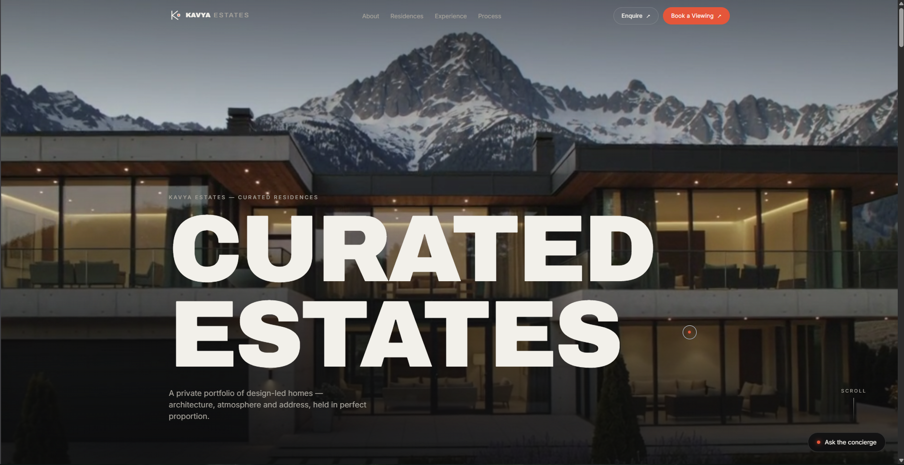
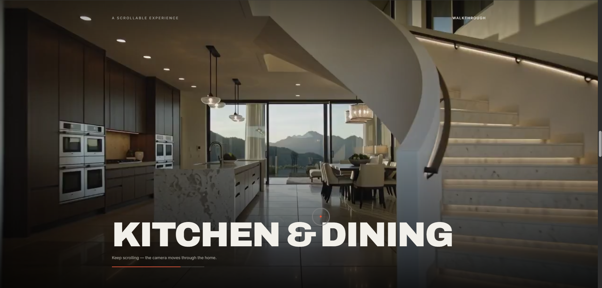
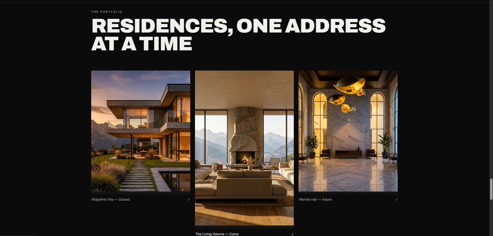
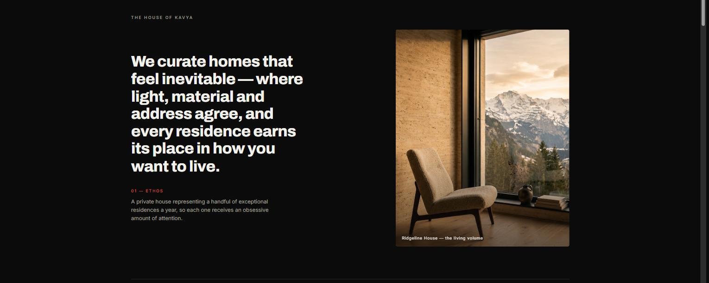
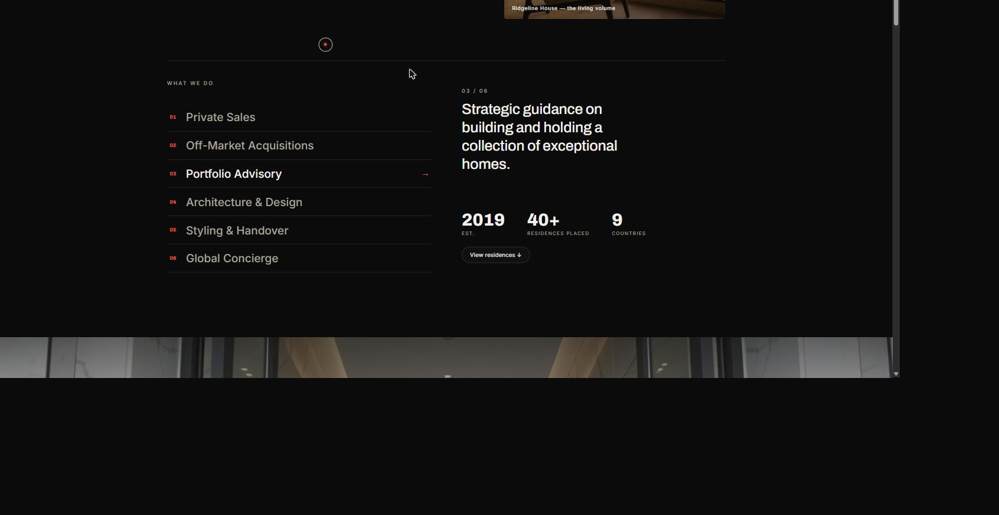
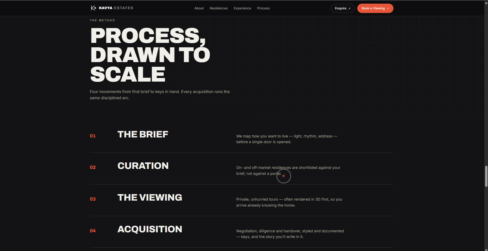
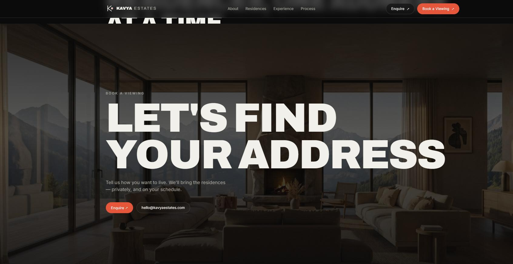
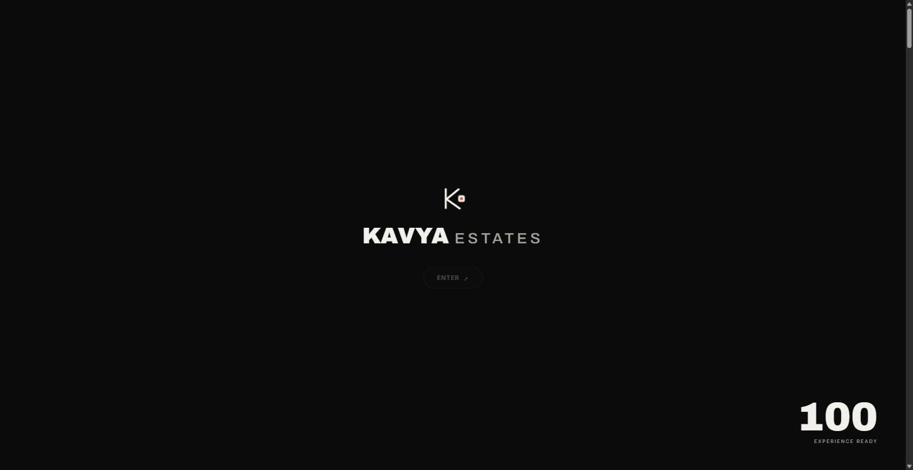
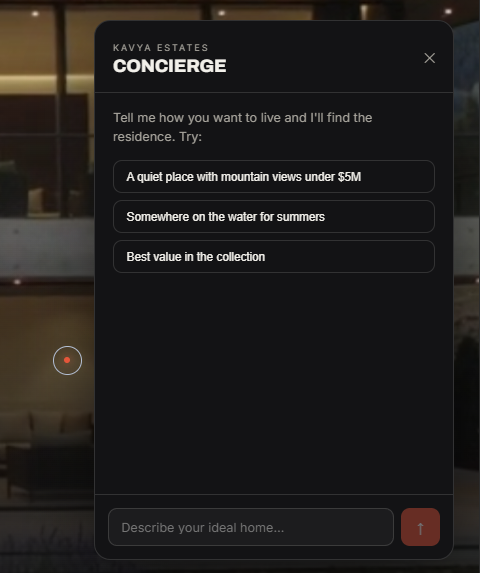
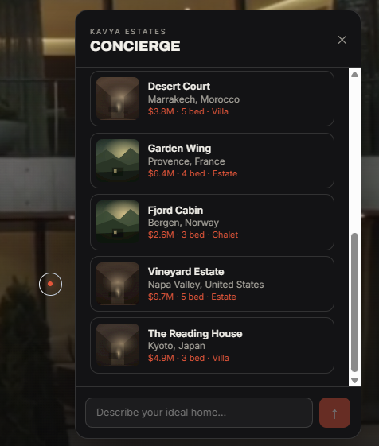

# Kavya Estates — Cinematic Real-Estate Experience

An immersive, scroll-driven landing experience for a fictional luxury property house, with a built-in **AI concierge**. Built as an experiment in **AI-native development** — the code, imagery, cinematic video, and the concierge each came from a different model, orchestrated and engineered together into one product.

**▶ Live:** [estate-cin.vercel.app](https://estate-cin.vercel.app/) · **Walkthrough video:** _drag your `demo.mp4` into this README on GitHub_



---

## Overview

Kavya Estates is an original concept — a design-led property brand whose website is the product. The goal was two-fold: see how close the browser can get to a film-grade, scroll-controlled experience, and build the whole thing by directing AI tools rather than hand-writing every layer.

Two ideas drive the front end:

- **Scroll is the camera.** The hero tilts in 3D, and the "walkthrough" section is a real video whose playhead is driven by scroll position — you move *through* the home as you scroll.
- **It thinks.** A retrieval-augmented concierge answers natural-language briefs ("a quiet place with mountain views under $5M") and recommends from a real residences dataset.

## A look around

<table>
  <tr>
    <td width="50%"><br/><sub><b>Hero</b> — 3D-tilt video with a cycling headline</sub></td>
    <td width="50%"><br/><sub><b>Walkthrough</b> — a real video scrubbed by scroll position</sub></td>
  </tr>
  <tr>
    <td width="50%"><br/><sub><b>Residences</b> — parallax gallery, generated photography</sub></td>
    <td width="50%"><br/><sub><b>Statement</b> — two-column editorial with a parallax image</sub></td>
  </tr>
  <tr>
    <td width="50%"><br/><sub><b>Services</b> — hover-driven list with a live detail panel</sub></td>
    <td width="50%"><br/><sub><b>Process</b> — staggered reveals on a blueprint grid</sub></td>
  </tr>
  <tr>
    <td width="50%"><br/><sub><b>Contact</b> — parallax CTA with a masked headline reveal</sub></td>
    <td width="50%"><br/><sub><b>Intro</b> — animated monogram, load counter, click-to-enter gate</sub></td>
  </tr>
</table>

## Highlights

- **AI concierge** — RAG over a residences corpus: embeddings + semantic search, streaming answers, tool-calling for hard filters (see below).
- **Intro sequence** — an animated monogram that draws on, a load counter, and a click-to-enter gate that splits open into the site. No flash of unstyled or mid-scroll content.
- **3D tilt hero** — a looping generated video plane that rotates in perspective and parallaxes to the cursor as you scroll.
- **Scroll-scrubbed walkthrough** — a stitched, all-intra-encoded video seeked frame-accurately from scroll progress, with a matched first-frame poster (zero pop-in) and a touch-device loop fallback.
- **Editorial motion throughout** — word-by-word reveals, parallax gallery, masked headline reveals, custom cursor — all on GSAP ScrollTrigger over Lenis smooth scroll.

## Tech stack

| Area | Choice |
| --- | --- |
| Framework | Next.js 14 (App Router), TypeScript |
| Animation | GSAP + ScrollTrigger, Lenis smooth scroll |
| AI | Vercel AI SDK v7, `@ai-sdk/google` (Gemini) |
| Styling | styled-jsx + CSS custom properties (no UI kit) |
| Media | Local `mp4` (H.264) + generated stills |
| Deploy | Vercel |

## AI Concierge (RAG)

A retrieval-augmented concierge is built into the site (floating "Ask the concierge" widget).

- **Embeddings + semantic search** — the residence corpus (`lib/residences.ts`) is embedded with Gemini (`gemini-embedding-001`) and cached in memory; each query is embedded and ranked by cosine similarity (`lib/concierge.ts`).
- **Grounded streaming generation** — the top matches are injected as context and the answer streams token-by-token from `gemini-2.5-flash` (`app/api/concierge/route.ts`).
- **Tool-calling** — a `filter_residences` tool lets the model apply hard constraints (budget, bedrooms, country, view) instead of guessing.
- Matched residences render as cards in the chat.

In-memory cosine similarity, no external vector DB — the right call for a ~15-item corpus.

<table>
  <tr>
    <td width="50%"><br/><sub>Natural-language brief with suggested prompts</sub></td>
    <td width="50%"><br/><sub>Retrieved residences rendered as cards</sub></td>
  </tr>
</table>

## Running locally

```bash
npm install
cp .env.local.example .env.local   # then add your Google AI Studio key
npm run dev      # http://localhost:3000
npm run build    # production build
```

Node 18+. The concierge needs `GOOGLE_GENERATIVE_AI_API_KEY` (from [Google AI Studio](https://aistudio.google.com/apikey)) in `.env.local` locally and in your Vercel project's Environment Variables in production. The rest of the site runs without it.

---

## Build notes — a case study

This project was as much an experiment in AI-native development as a design piece. Rather than hand-write every layer, I orchestrated a different model for each part and did the direction, integration, and engineering calls in between. Here's the honest version of how it went.

### The pipeline

- **Code & motion system** — built with Claude, with me directing the architecture, debugging, and every animation and encoding decision.
- **Stills** (hero, statement, gallery) — generated with Higgsfield / nano-banana; the free tier's 10 credits bought five photoreal interiors and exteriors.
- **Cinematic video** (hero + walkthrough) — generated in Kling, then composited with `ffmpeg`.
- **Concierge** — Gemini via the Vercel AI SDK for embeddings, streaming generation, and tool-calling.

### What broke, and how I fixed it

The fixes are the engineering:

- **The API video path didn't exist.** Higgsfield's free plan blocks video generation, and Kling's trial credits are usable only in its own app, not via API. So I generated the clips in the Kling app, then did the compositing myself: cropped the watermark, crossfade-stitched two clips into one, and re-encoded **all-intra (`-g 1`) H.264** so scroll-scrubbing can seek to any frame smoothly.
- **`overflow-x: hidden` silently broke `position: sticky`** — the pinned walkthrough rendered black. `overflow-x: clip` fixes it: `hidden` creates a scroll container that disables sticky; `clip` doesn't.
- **A reduced-motion guard was disabling *all* animation** — and my headless QA had forced the OS setting off, so I nearly shipped a site that looked completely static for anyone browsing with "reduce motion" enabled. Caught it, removed the kill-switch.
- **First-paint flash.** On reload the browser restored scroll to mid-page and painted it before the intro. Fixed by disabling scroll restoration pre-paint and adding a plain-CSS boot cover that's opaque on the first frame, independent of when styled-jsx injects its styles.
- **Poster pop-in.** The scroll video's poster is extracted from the clip's own first frame, so the still→video handoff is invisible; the decoder is also primed early so the first scrub is ready.
- **Couldn't runtime-test the concierge at build time** (no API key in the build environment), so I compiled it against the real Vercel AI SDK v7 type definitions to guarantee the API usage was correct, and verified the LLM behaviour separately with a key.

### What I'd do differently

- Bundle the generated images locally instead of referencing the generation CDN — removes a dependency I don't control.
- Precompute embeddings at build time rather than lazily on first request.
- Do real mobile-device QA earlier; scroll-scrubbed video especially needs it.
- The tool-calling is present but light — a stronger version would let the model drive multi-constraint search end to end.
- Honestly: this began as a study of two reference videos before becoming its own concept. Calling it original is fair, but the origin was an exercise, and I'd rather say so.

## Roadmap

- **Dynamic residence routes** (`/residences/[slug]`) driven by the data model.
- Persisted inquiry flow (server action → email/DB).

## License

MIT — see [LICENSE](LICENSE).
